  <!-- Dynamic Typing Header -->
  

 

  
   

  <table border="0">
    <tr>
      <td>
        
      </td>
      <td>
        
      </td>
    </tr>
  </table>

   

  <!-- Snake Game Contribution Animation -->
  <picture>
    <source media="(prefers-color-scheme: dark)" srcset="https://raw.githubusercontent.com/basith-ahamad-dev/basith-ahamad-dev/output/github-contribution-grid-snake-dark.svg" />
    <source media="(prefers-color-scheme: light)" srcset="https://raw.githubusercontent.com/basith-ahamad-dev/basith-ahamad-dev/output/github-contribution-grid-snake.svg" />
    
  </picture>

---

### 🛠️ Tech

  

 

- **Languages & Frameworks:** PHP, Laravel, Python, FastAPI, Flask, JavaScript (ES6+), React, MySQL
- **CMS & Web:** WordPress, Elementor Pro, WooCommerce, Custom Themes & Plugins
- **Automation & AI:** n8n, WhatsApp Cloud API, Webhooks, MobileNetV2, TensorFlow, OpenCV

---

### 🚀 Key Projects

- **[HERIT-EDGE](https://github.com/basith-ahamad-dev)** — AI-powered multi-vendor e-commerce platform with image-based visual product search.  
  `PHP` • `FastAPI` • `Python` • `MobileNetV2` • `OpenCV` • `MySQL`

- **[DetectX](https://github.com/basith-ahamad-dev)** — Deep learning web app for plant disease detection across 38 crop disease classes with real-time symptoms & organic remedies.  
  `Python` • `TensorFlow` • `Flask` • `MobileNetV2` • `Tailwind CSS`

- **[TileViz](https://github.com/basith-ahamad-dev)** — Real-time interactive 3D showroom tile visualizer for interior and architectural spaces.  
  `JavaScript` • `WebGL / 3D Canvas` • `CSS3`

---

### 🌐 Connect

  
Always open to exciting opportunities, innovative ideas, and tech discussions.

  

    
    &nbsp;
    
    &nbsp;
    
  

  

    
    &nbsp;
    
  

    
  
<i>"Transforming ideas into scalable code, elegant user experiences, and automated workflows."</i>

  <!-- Animated Footer Wave -->
  

