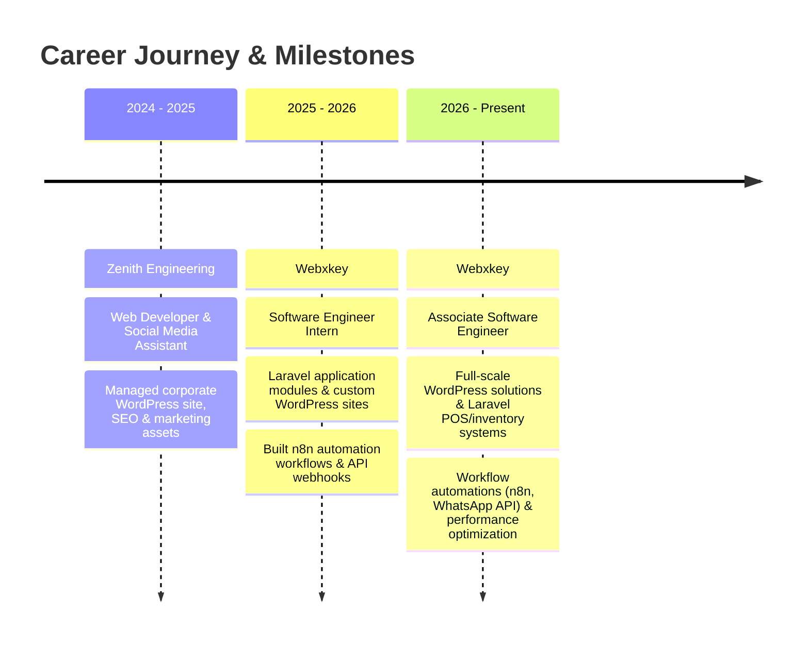

  <!-- Header Banner -->
  

  <!-- Animated Typing Headline -->
  

   

  <!-- Quick Social & Contact Badges -->
  

    
    
    
    
    
  

  

 

## 👨‍💻 About Me

Hello! I'm **Basith Ahamad**, a passionate **Software Engineer**, **Full-Stack Developer**, and **WordPress Specialist** based in Gampaha, Sri Lanka. I hold a **First-Class Honours BSc in Computer Science** and specialize in building high-performance web applications, robust backend ecosystems, custom CMS architectures, and intelligent workflow automations.

- 💼 **Current Position:** Associate Software Engineer at **[Webxkey](https://webxkey.com)** — engineering bespoke WordPress solutions, Laravel enterprise systems (POS, inventory & management portals), and third-party API automations.
- 🎓 **Academic Excellence:** Graduated with **First-Class Honours** in BSc (Hons) Computer Science from **University of Bedfordshire (UK)** / SLIIT City Uni, and **First Class with Distinction** in HND Computer Engineering from **Marwadi University (India)**.
- 🤖 **AI & Machine Learning:** Experienced in designing & integrating deep learning computer vision models (**MobileNetV2**, **TensorFlow**, **OpenCV**) into production web applications using **FastAPI** & **Flask**.
- ⚡ **Workflow Automation:** Skilled in connecting enterprise tools, webhooks, and communication channels using **n8n**, WhatsApp Cloud API, and Meta Graph APIs.
- 🎯 **Engineering Philosophy:** Clean code, modular architectures, peak performance, and responsive, accessible UI/UX.

 

  

 

## 🛠️ Technical Arsenal

  

 

| Domain | Technologies &amp; Tools |
| :--- | :--- |
| **Languages** | `PHP` `Python` `JavaScript (ES6+)` `HTML5` `CSS3` `SQL` |
| **Backend &amp; Frameworks** | `Laravel` `FastAPI` `Flask` `React` `Node.js (Basics)` `RESTful APIs` |
| **CMS &amp; Web Builders** | `WordPress` `Elementor / Elementor Pro` `WPBakery` `Custom Themes & Plugins` `WooCommerce` |
| **Databases** | `MySQL` `SQLite` `Database Triggers & Optimization` |
| **Automation &amp; Integrations** | `n8n` `WhatsApp Cloud API` `Webhooks` `Meta Graph API (FB / IG)` `Zapier` |
| **AI / Machine Learning** | `TensorFlow` `Keras` `MobileNetV2` `OpenCV` `Computer Vision` `Image Classification` |
| **Styling &amp; UI/UX** | `Tailwind CSS` `Bootstrap 5` `Figma` `Responsive & Mobile-First Design` |
| **Tools &amp; Workflow** | `Git` `GitHub` `VS Code` `Cursor` `Postman` `Composer` `npm` `Agile / Scrum` `PRINCE2` |

 

  

 

## 🚀 Featured Projects

<table>
  <tr>
    <td width="50%" valign="top">
      <h3 align="left">🛒 HERIT-EDGE — Multi-Vendor E-Commerce with AI Image Search</h3>
      

        <b>Final-Year Capstone Project</b> 
        A scalable multi-vendor e-commerce platform featuring intelligent, AI-driven visual product recommendations.
      

      <ul>
        <li><b>Multi-Tenant Portals:</b> Complete Admin, Customer, and Seller dashboards with role-based access control (RBAC).</li>
        <li><b>AI Visual Search:</b> Integrated <b>FastAPI</b> and <b>MobileNetV2</b> with <b>OpenCV</b> for real-time reverse image product search.</li>
        <li><b>Full-Stack Backend:</b> Engineered robust order management, inventory tracking, secure checkout, and chatbot integration.</li>
      </ul>
      

        
        
        
        
        
      

    </td>
    <td width="50%" valign="top">
      <h3 align="left">🌿 DetectX — AI Plant Disease Detection System</h3>
      

        <b>Individual Research Project</b> 
        An intelligent deep learning web platform for instant plant leaf disease diagnosis and treatment guidance.
      

      <ul>
        <li><b>Deep Learning Engine:</b> MobileNetV2 CNN classifier trained across <b>38 distinct crop disease classes</b>.</li>
        <li><b>Inference Web API:</b> High-speed <b>Flask</b> backend delivering real-time predictions and confidence scores.</li>
        <li><b>Interactive UI:</b> Responsive frontend displaying comprehensive symptom analysis and actionable organic remedy recommendations.</li>
      </ul>
      

        
        
        
        
        
      

    </td>
  </tr>
  <tr>
    <td colspan="2" valign="top">
      <h3 align="left">🎨 TileViz — 3D Real-Time Tile Visualizer for Showrooms</h3>
      

        Interactive 3D web-based visualization tool tailored for tile showrooms, architects, and homeowners to customize floor and wall tiles live in 3D photorealistic room environments.
      

      

        
        
        
        
      

    </td>
  </tr>
</table>

 

  

 

## 💼 Work Experience

- 🏢 **Associate Software Engineer** @ **Webxkey** *(June 2026 – Present)*
  - Developed responsive, custom WordPress websites using Elementor, custom themes, and plugins.
  - Built Laravel-based POS, inventory, and enterprise business management systems.
  - Optimized site performance, SEO, mobile responsiveness, and page speed index scores.
  - Designed automated business workflows with **n8n**, WhatsApp Cloud API, and webhooks.
- 🏢 **Software Engineer Intern** @ **Webxkey** *(September 2025 – June 2026)*
  - Contributed to production Laravel backend modules and responsive WordPress client portals.
  - Integrated third-party APIs and automated notification pipelines.
  - Diagnosed and resolved UI/UX and backend bugs in an Agile sprint environment.
- 🏢 **Web Developer & Social Media Assistant** @ **Zenith Engineering** *(August 2024 – April 2025)*
  - Maintained corporate WordPress digital presence, created new pages, and handled SEO enhancements.

 

  

 

## 🎓 Education & Certifications

- 🎓 **BSc (Hons) in Computer Science** *(2025 – 2026)*
  - **University of Bedfordshire (UK) | SLIIT CITY UNI (SL)**
  - Result: **First Class Honours**
- 🏆 **Higher National Diploma in Computer Engineering** *(2021 – 2024)*
  - **Marwadi University (IND)**
  - Result: **First Class With Distinction**
- 📜 **Certified WordPress Developer**
  - **DP Education IT Campus** — CMS management, layout deployment, theme development & responsive architecture.
- 📖 **Diploma in English Language and Literature** *(2024 – 2026)*
  - **Aquinas College of Higher Studies (SL)**

 

  

 

## 📊 GitHub Analytics

  <table border="0">
    <tr>
      <td>
        
      </td>
      <td>
        
      </td>
    </tr>
    <tr>
      <td colspan="2" align="center">
        
      </td>
    </tr>
  </table>

 

  

 

## 🤝 Let's Connect & Build Together!

I'm always open to discussing new engineering opportunities, freelance projects, open-source collaborations, or innovative startup ideas.

  
  &nbsp;
  
  &nbsp;
  

 

  
<i>"Transforming ideas into scalable code, elegant user experiences, and automated workflows."</i>

  
  <!-- Animated Footer Wave -->
  

