  <!-- Header Banner -->
  

    

  <!-- Quick Social Badges -->
  

    
    &nbsp;
    
    &nbsp;
    
    &nbsp;
    
    &nbsp;
    
  

  

### ⚡ Quick Intro

- 💼 **Associate Software Engineer** at **Webxkey** — building custom WordPress websites, Laravel business platforms (POS & inventory), and automated workflows.
- 🎓 **First-Class Honours** in BSc (Hons) Computer Science (*University of Bedfordshire, UK*).
- 🤖 **AI & Automations** — integrating deep learning computer vision (**MobileNetV2**, **OpenCV**, **FastAPI**) and business automations (**n8n**, **WhatsApp Cloud API**).
- 📍 Based in **Gampaha, Sri Lanka** • Open to collaborations and freelance projects.

---

### 🛠️ Tech Stack

  

 

- **Languages & Frameworks:** PHP, Laravel, Python, FastAPI, Flask, JavaScript (ES6+), React, MySQL
- **CMS & Web:** WordPress, Elementor Pro, WooCommerce, Custom Themes & Plugins
- **Automation & AI:** n8n, WhatsApp Cloud API, Webhooks, MobileNetV2, TensorFlow, OpenCV

---

### 🚀 Key Projects

- **[HERIT-EDGE](https://github.com/basith-ahamad-dev)** — AI-powered multi-vendor e-commerce platform with image-based visual product search.  
  `PHP` • `FastAPI` • `Python` • `MobileNetV2` • `OpenCV` • `MySQL`

- **[DetectX](https://github.com/basith-ahamad-dev)** — Deep learning web app for plant disease detection across 38 crop disease classes with real-time symptoms & organic remedies.  
  `Python` • `TensorFlow` • `Flask` • `MobileNetV2` • `Tailwind CSS`

- **[TileViz](https://github.com/basith-ahamad-dev)** — Real-time interactive 3D showroom tile visualizer for interior and architectural spaces.  
  `JavaScript` • `WebGL / 3D Canvas` • `CSS3`

---

  ### 🤝 Let's Connect!

  
Always open to exciting opportunities, innovative ideas, and tech discussions.

  

    
    &nbsp;
    
    &nbsp;
    
  

   
  

